# InsightFlow

**InsightFlow** is an advanced project for real-time news retrieval and research. It leverages AI-driven agents to retrieve, scrape, summarize, and write news articles about a given topic. The project utilizes technologies like **Ollama**, **Llama 3.2**, **CrewAI**, and **Serper** to streamline the process of gathering and presenting news.

## Project Overview

InsightFlow consists of four core agents, each designed to perform specific tasks in the news retrieval and content creation process:

1. **News Retriever**
2. **News Scraper**
3. **News Summarizer**
4. **News File Writer**

Each agent is responsible for a unique aspect of the workflow, ensuring that the latest news is gathered, analyzed, summarized, and saved efficiently.

## Agents and Their Tasks

### **1. News Retriever Agent**

- **Role**: `{topic} News Retriever`
- **Goal**: Uncover cutting-edge developments in `{topic}`.
- **Backstory**: You are a seasoned researcher with expertise in finding the most relevant and up-to-date information. Your ability to gather and present complex data in an understandable way is what sets you apart.

#### **Task: news_retrieve_task**
- **Description**: Conduct a thorough research about `{topic}`. Ensure you find any interesting and relevant information, considering the current year is 2024.
- **Expected Output**: A list of 5 websites with the most relevant information about `{topic}`.
- **Agent**: newsRetriever

### **2. News Scraper Agent**

- **Role**: News Website Scraper
- **Goal**: Scrape the website for the latest news and information.
- **Backstory**: You are an expert in web scraping, known for your attention to detail and skill in navigating complex websites. You excel at extracting meaningful content that provides the latest updates.

#### **Task: news_Scraper_task**
- **Description**: Scrape the website for the latest news and information.
- **Expected Output**: Fully scraped websites with all the important information from the website.
- **Agent**: newsScraper

### **3. News Summarizer Agent**

- **Role**: AI News Writer
- **Goal**: Write a concise and informative news article based on the provided information.
- **Backstory**: As a skilled writer, you can take intricate or technical information and distill it into a clear, concise article. You have a knack for making complex subjects engaging for readers.

#### **Task: news_Summerizer_task**
- **Description**: Summarize the information from the websites into a fully fledged news article in markdown format.
- **Expected Output**: A fully fledged news article with the main topics, each with a full section of information. Formatted as markdown without '```'.
- **Agent**: newsSummerizer

### **4. News File Writer Agent**

- **Role**: News File Writer
- **Goal**: Write the news article to a file.
- **Backstory**: You are skilled in writing and organizing articles in a way that makes them easy to read and access. You ensure the information is well-documented and saved appropriately for later use.

#### **Task: news_File_Writer_task**
- **Description**: Write the news article to a file.
- **Expected Output**: A fully-fledged news article with all information from the previous task saved to a file named `news/{date}_news_article.md`.
- **Agent**: newsFileWriter

## Tools Used in InsightFlow

### **1. Ollama**
Ollama is an open-source platform designed for building and running large language models (LLMs). In **InsightFlow**, Ollama is used for generating context-aware summaries and processing the data retrieved by the agents.

### **2. Llama 3.2**
Llama 3.2 is a powerful, versatile language model. It helps in processing the information extracted by the news agents, enabling efficient summarization and understanding of complex news topics.

### **3. CrewAI**
CrewAI is used to orchestrate the flow of tasks between different agents in **InsightFlow**, ensuring smooth and efficient interaction between the news retriever, scraper, summarizer, and file writer agents.

### **4. Serper**
Serper is a search engine tool integrated with **InsightFlow** to gather the most relevant and up-to-date articles based on the specified topics. It helps the **News Retriever Agent** find the latest sources for the given topic.

## How InsightFlow Works

1. **News Retriever Agent** starts by gathering the most relevant websites for the topic.
2. **News Scraper Agent** scrapes these websites for the latest news and relevant details.
3. **News Summarizer Agent** takes the scraped data and generates a concise news article summarizing the key points.
4. **News File Writer Agent** writes the article to a markdown file, making it easy to save and access.

## Demo Code

Here’s a demonstration of how images are displayed in **InsightFlow** for topic research. The images shown below are part of the demo for showcasing how the system processes and displays relevant visuals for the given topic.

### **Images Demo:**

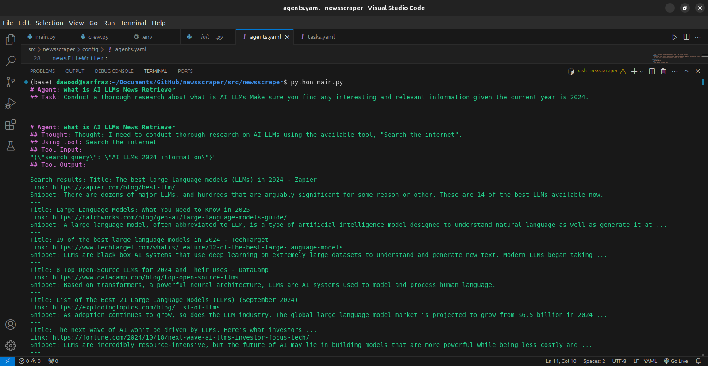
*Example image for topic 1*

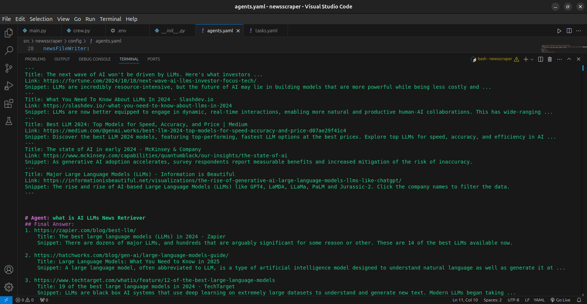
*Example image for topic 2*

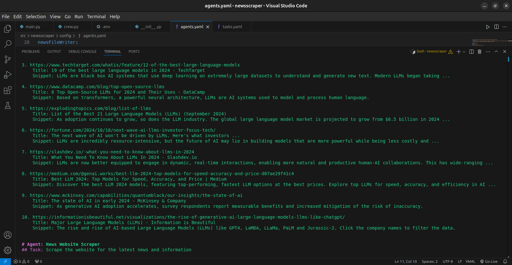
*Example image for topic 3*

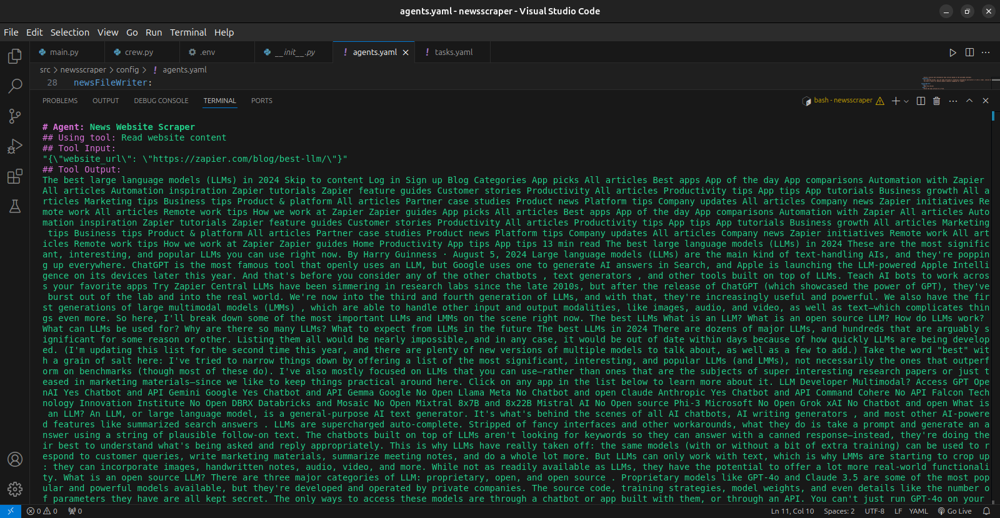
*Example image for topic 4*

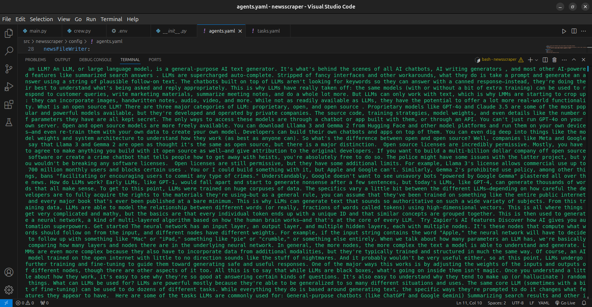
*Example image for topic 5*

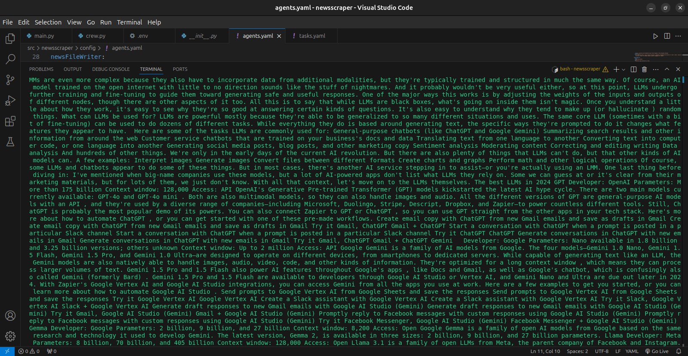
*Example image for topic 6*

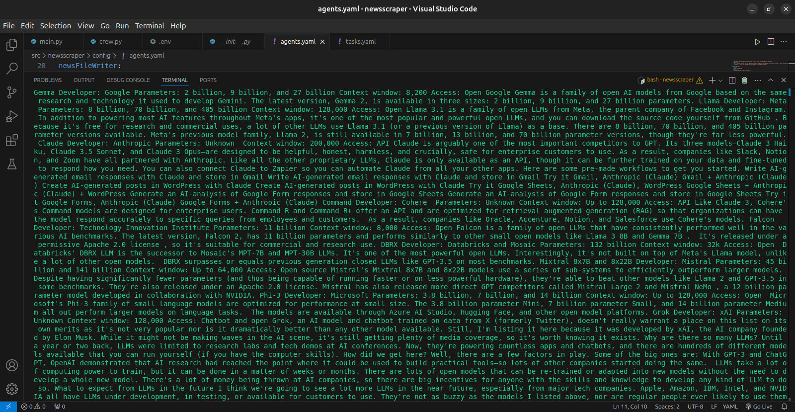
*Example image for topic 7*

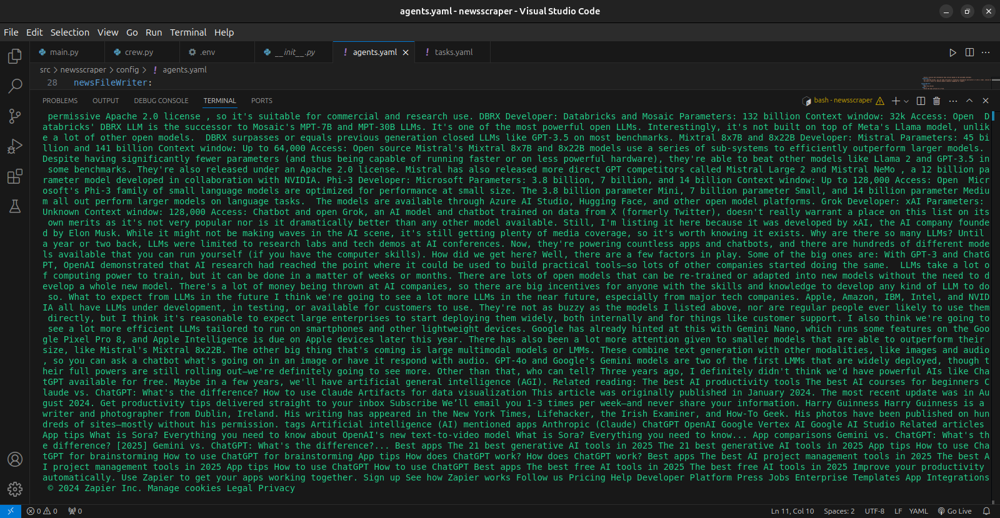
*Example image for topic 8*

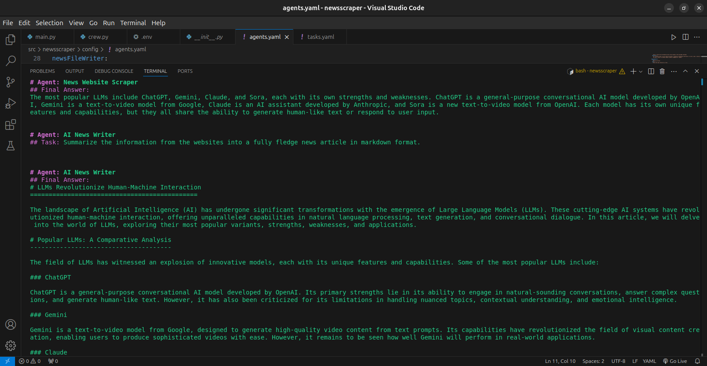
*Example image for topic 9*

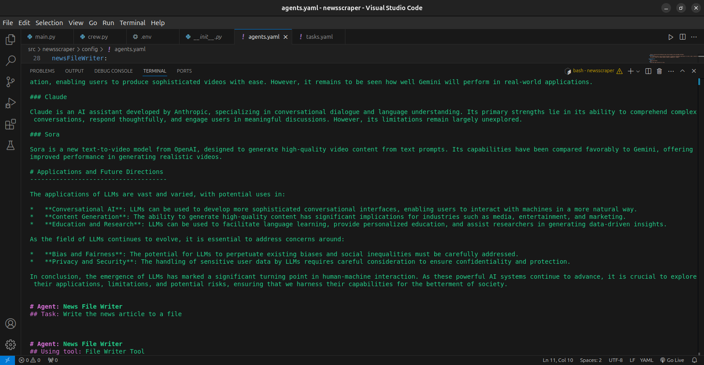
*Example image for topic 10*

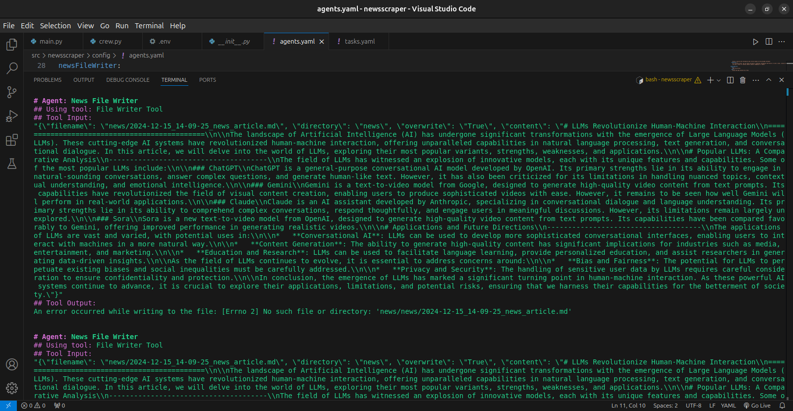
*Example image for topic 11*

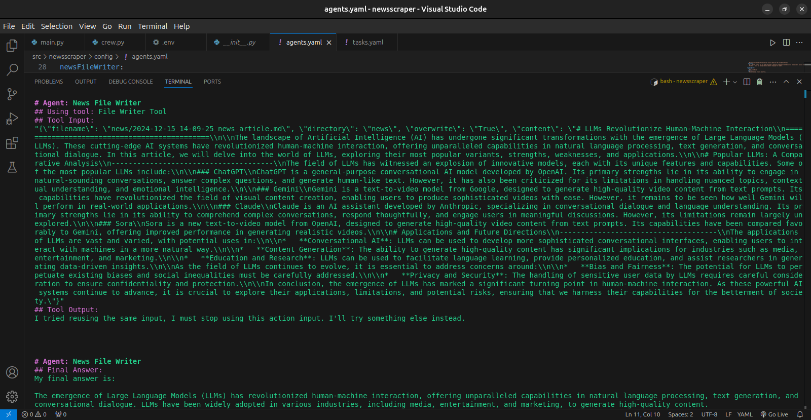
*Example image for topic 12*

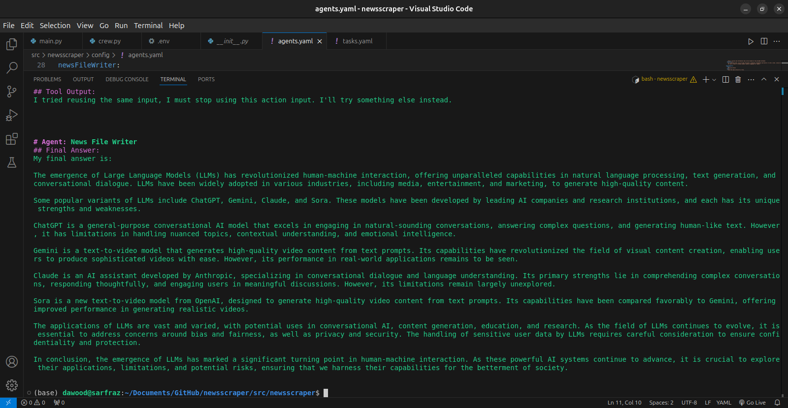
*Example image for topic 13*

These images represent visual data relevant to the topic research process in **InsightFlow**. The images are included to provide a better understanding of how the project processes and utilizes visual data in conjunction with text-based news retrieval.

## Getting Started

To use **InsightFlow**, clone the repository and follow the instructions to install the necessary dependencies and run the agents.

```bash
git clone https://github.com/Daudsarfraz/InsightFlow.git
cd InsightFlow
# Install dependencies (if applicable)

